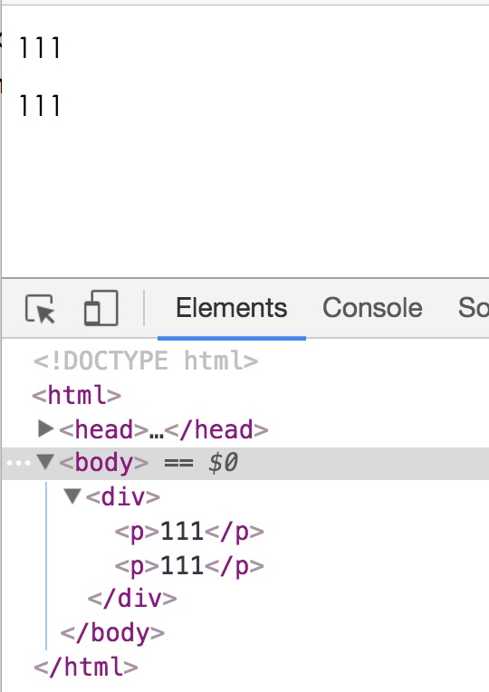

#将内容输出到页面
##Output the content to the page

与后端模板一样,avalon能将动态的内容放到它们该呆的地方.并且提供多种便捷的方式. 第一种就是双花括号`{{}}`,第二种是`ms-text`属性.如果要输出大段HTML内容,还可以用ms-html 

As same as the back-end templates, Avalon will be able to put dynamic content to the place where they should be, and provide a variety of convenient ways.The first one is double parentheses, the second is the ms-text attribute. If you want to output a large segment of the HTML content, can also use ms-html

*   `<span>{{@aaa}}</span`
*   `<span ms-text="@bbb"></span>`
*   `<div ms-html="@bbb"></div>`

双花括号是最便捷的方式，因此许多MVVM框架都支持这种语法，它类似于JSP的`<%= aa %>`。 动态内容可以是VM中的属性，方法，或多个属性组成的表达式。 为了方便avalon知晓这些属性是来自VM而不是来自全局对象，需要在这些属性或方法前面加上一个**@**。
  
Double brace is the most convenient way, so many of the MVVM framework to support this syntax, it is similar to the JSP` <%= aa % >`. Dynamic content can be a property,  method, or an expression of a number of properties in VM.   In order to help Avalon to know that these properties are derived from VM  rather than from the global scope,   you need to add a  **@** in front of these properties or methods.

但在你与其他模板一起混用时，可能占用了@符号，因此avalon给出另一个选择，改用##符号

But when you mix with other templates, may occupy the @ symbol,  so Avalon gives another choice to ## symbol

```html
 <div ms-controller="test">
     <p ms-text="@aaa"></p>
      <p>{{@aaa}}</p>
 </div>
```
It is equivalent to the following
```html
 <div ms-controller="test">
     <p ms-text="##aaa"></p>
      <p>{{##aaa}}</p>
 </div>
```

```javascript
avalon.config({
    interpolate: ["{&","&}"]
})
```

```html
 <div ms-controller="test">
     <p ms-text="##aaa"></p>
      <p>{& ##aaa &}</p>
 </div>
```

The complete example：
```html
<!DOCTYPE html>
<html>
<head>
    <title>avalon</title>
    <meta charset="UTF-8">
    <meta name="viewport" content="width=device-width, initial-scale=1.0">
    <script src="dist/avalon.js"></script>
    <script>
        avalon.config({
            interpolate: ["{&", "&}"]
        })
        avalon.define({
            $id: 'test',
            aaa: 111,
            bbb: 222
        })
    </script>
</head>

<body>
    <div ms-controller="test">
        <p ms-text="##aaa"></p>
        <p>{& ##aaa &}</p>
    </div>
</body>
</html>

```
