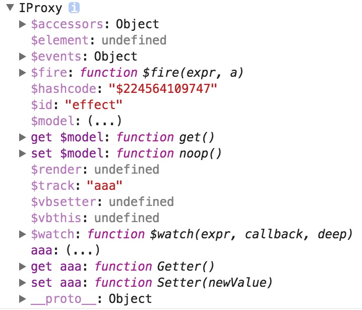

#VM

这一节我们介绍avalon的VM。VM即ViewModel，我们所有业务代码都围绕它进行编写，就像后端，所有代码都是以类的形式来编写一样。

In this section we introduce avalon's VM. VM that is the so-called ViewModel, we have all the business code around it to write, just like the back-end all the code is written in the form of the same Class.

avalon的VM是通过avalon.define方法产生的，它不等于用户传入的那个对象。

```javascript
var data = {
    $id: 'test',
     aaa: 111
}
var vm = avalon.define(data)
console.log(vm === data) //false
```

视浏览器版本或avalon的版本不同，VM的类型与结构是不一样的。


Depending on the version of the browser or the version of avalon, the type and structure of the VM is different.

| &nbsp;     | IE6-8    | IE9-11, modern browsers(not support es7 Proxy) | modern browsers(support es7 Proxy) |
|------------|----------|------------------------------------------------|------------------------------------|
| avalon2.2- | VBScript | Obsever                                        | Observer                           |
| avalon2.2+ | VBScript | IProxy                                         | Proxy                              |


**VBScript**是IE6－8内置的另一种脚本语言，它可以用set, get, let语法定义访问器属性

**VBScript** is another built-in scripting language for IE6-8 that defines accessor properties with set, get, and let syntax.

https://github.com/RubyLouvre/avalon/blob/v2.1.16/src/vmodel/parts/createViewModel.js#L35-L123

**Observer**，是一个javascript构造函数产生的实例，它使用了Object.defineProperties来定义访问器属性

**Observer**, is an instance of a javascript constructor that uses Object.defineProperties to define accessor properties

https://github.com/RubyLouvre/avalon/blob/v2.1.16/src/vmodel/modern.js#L23-L25

https://msdn.microsoft.com/en-us/library/hh965578(v=vs.94).aspx


**IProxy**，是一个javascript构造函数产生的实例，它使用了Object.defineProperties来定义访问器属性

**IProxy** is an instance of a javascript constructor that uses Object.defineProperties to define accessor properties

https://github.com/RubyLouvre/avalon/blob/2.2.0/src/vmodel/share.js#L33-L55


**Proxy**，是一个es6 新添加的特征，Proxy可以监听对象身上发生了什么事情,并在这些事情发生后执行一些相应的操作。它比访问器属性强多了，因此它将是avalon实现VM的主要手段。

**Proxy** is a new feature added by es6. Proxy can listen for what is happening on the object and do something after that happens. It is much more powerful than the accessor property, so it will be the primary means for Avalon to implement the VM.

https://github.com/RubyLouvre/avalon/blob/2.2.0/src/vmodel/proxy.js#L39-L43

https://developer.mozilla.org/en-US/docs/Web/JavaScript/Reference/Global_Objects/Proxy

我们在定义VM时，必须指定`$id`属性，并且尽量不要用`$`属性开头，因为`$`属性是留给框架用，并且不能转换为访问器属性。目前，avalon保留了以下几个属性：`$id`,  `$element`,  `$render`， `$fire`， `$watch`， `$track`， `$events`，`$accessors`,`$hashcode`, `$model`。我们平时只会`$fire`, `$watch`与`$model`。

When defining a VM, you must specify the $id attribute, and try not to start with the `$` attribute because the `$-prefix` attribute is left to the framework and can not be converted to an accessor property. Currently, avalon have the following properties: `$id`, `$element`, `$render`, `$fire`, `$watch`, `$track`, `$events`, `$accessors`,`$hashcode`, `$model`. We usually use  `$ fire`,` $ watch` and `$ model`.



**$watch**是用于监听属性的变化，然后唤用一个回调

**$watch** is used to listen for changes in attributes, and then call a callback

```javascript
var vm = avalon.define({
   $id: 'test',
   aaa: 111
})
vm.$watch("aaa", function(a, b, c){
    console.log(a, b) //999, 111, 'aaa'
})
vm.aaa = 999
```

**$fire**是用于触发监听的回调

**$fire** trigger callbacks for the given **$watch**

```javascript
var vm = avalon.define({
   $id: 'test',
   aaa: 111
})
vm.$watch("aaa", function(a, b, ccc){
    console.log(a, b) //777, 111, 'aaa'
})
vm.$fire('aaa', 777)  
```

你能监听更复杂的路径（除非它在数组之内）:

You can listen for more complex paths (unless it's in an array)

```javascript
var vm = avalon.define({
   $id: 'test',
   aaa: {
      bbb: {
         ccc: 111
      }
   }
})
vm.$watch("aaa.bbb.ccc", function(a, b){
    console.log(a, b) //888, 111
})
vm.aaa.bbb.ccc = 888
```
 
`$model`是返回一个纯净的javascript对象，不包含$id, $element等属性，也不包含访问器属性，它用于AJAX等与后端交互的场合。


`$model` returns a pure javascript object that does not contain $ id, $ element, and so on, and does not include accessor properties, which are used in AJAX and other backend interactions.

[example](./lesson03.html)
