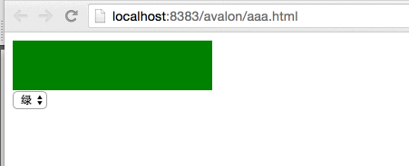
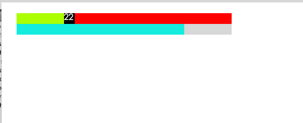

#006样式操作  
#006STYLE  
avalon2的ms-css的变革思路与ms-attr一样，将多个操作合并成到一个对象里面处理，因此没有ms-css-name="value"，只有ms-css="Object"或ms-css="Array".  
avalon2 redesigned `ms-css` in a same way as `ms-attr`,gather all your css values into one single object,so there is `ms-css-name="value"` no more,only `ms-css=Object"` or `ms-css=Array` will work properly.  

注意，当你用对象字面量的方式传参时，注意存在－号的键名要用“”号括起来。  
pelease pay attention to this,while your css object propertie names contain a hyphen,be aware to use a pair of double quotation marks to include this property,because hyphen marks are illegal being property names
`<div ms-css="{font-size: @fs}"></div>`  
这个会报错.正确写法是以下两种  
it's a wrong example,these two below are correct   
`<div ms-css="{fontSize: @fs}"></div>`

`<div ms-css="{'font-size': @fs}"></div>`  

在avalon1.*系列，允许你在属性值中加入插值表达式，如  
in avalon1.* series,it allows you to insert a Interpolation expression into directive value,such as  
`ms-css-width=”prop”(会自动补px)，ms-css-height=”{{prop}}%”, ms-css-color=”prop”, ms-css-background-color=”prop”, ms-css-font-size=”{{prop}}px`  
`ms-css-width=”prop”(avalon will add `px` for you )，ms-css-height=”{{prop}}%”, ms-css-color=”prop”, ms-css-background-color=”prop”, ms-css-font-size=”{{prop}}px`  
这些在avalon2中都不支持，它顶多帮你的样式加上厂商前缀，驼峰化，对数字属性加上px。  
this featrue is no more supported in avalon2, the framework only correct your style name and add `px` for number values.  

`<div ms-css="[{width:@width, height: @height+'px', color: @color, backgroundColor:@bg}, @otherStyleObject, @thirdStyleObject]"></div>`  
```
<!DOCTYPE html>
<html>
    <head>
        <meta http-equiv="Content-Type" content="text/html; charset=UTF-8"/>
        <script src="./dist/avalon.js"></script>
        <script>
            var vm = avalon.define({
                $id: "test",
                background: "red"
            })
        </script>
    </head>
    <body>
        <div ms-controller="test">
            <div style="width:200px; height:50px" 
                 ms-css="{background: @background}">
            </div>
            <select ms-duplex="@background">
                <option value="red">红</option>
                <option value="yellow">黄</option>
                <option value="green">绿</option>
            </select>
        </div>
    </body>
</html>
```
  
我们来看另一个动画效果：  
another animation example  
```
<!DOCTYPE html>
<html>
    <head>
        <meta http-equiv="Content-Type" content="text/html; charset=UTF-8">
        <script src="./dist/avalon.js" ></script>
        <script>
            var vm = avalon.define({
                $id: "test",
                percent: 0
            })
            var a = true
            var id = setInterval(function() {
                if (a) {
                    if (vm.percent < 100) {
                        vm.percent++
                    } else {
                        a = false
                    }
                } else {
                    if (vm.percent > 0) {
                        vm.percent--
                    } else {
                        a = true
                    }
                }
            }, 100)
        </script>
        <style>
            .handerx{
                width:20px;
                height:20px;
                position: absolute;
                color:#fff;
                background: #000;
            }
            .sliderx{
                width:100%;
                height:20px;
                position: relative;
            }
            .body{
                padding:40px;
            }
        </style>
    </head>
    <body ms-controller="test" class="body">
        <div class="slider" style="background:red;">
            <div class="handerx" ms-css="{left: @percent+'%'}" >{{ @percent }}</div>
            <div style="background: greenyellow;height:20px" ms-css="{width:@percent+'%'}"></div>
        </div>
        <div class="sliderx" style="background:#d2d2d2;">
            <div style="background: #2FECDC;height:20px" ms-css="{width:100-@percent+'%'}"></div>
        </div>
    </body>
</html>
```
  
最后看一下与ms-duplex结合使用的例子  
a example using `ms-duplex`  
```
<html>
    <head>
        <title>ms-css</title>
        <meta http-equiv="Content-Type" content="text/html; charset=UTF-8">
        <meta http-equiv="X-UA-Compatible" content="IE=edge" /> 
        <script src="./dist/avalon.js" ></script>
        <script>
            var vm = avalon.define({
                $id: "test",
                w: 100,
                h: 100,
                click: function () {
                    vm.w = vm.w + 10;
                    vm.h = vm.h + 10;
                }
            })

        </script>
    </head>
    <body>
        <div ms-controller="test">
            <div style=" background: #a9ea00;" ms-css='{width:@w,height:@h}' ms-click="@click"></div>
            <p>{{ @w }} x {{ @h }}</p>
            <!--change过滤器相当于原来data-duplex-event='change'-->
            <p>W: <input type="text" ms-duplex-number="@w|change" /></p>
            <p>H: <input type="text" ms-duplex-number="@h" /></p>
        </div>
    </body>
</html>
```
  
如果读者一口气看了N篇教程，建议马上到GITHUB里下avalon.js 的源码，动手试试。多看不如多码，那样才是成功的学习方式。  
Thank you for reading all these 6 lessons,I strongly suggest you to download avalon.js file and try to make some your own examples.Coding is much better than reading only,that is a successful way of learning.
